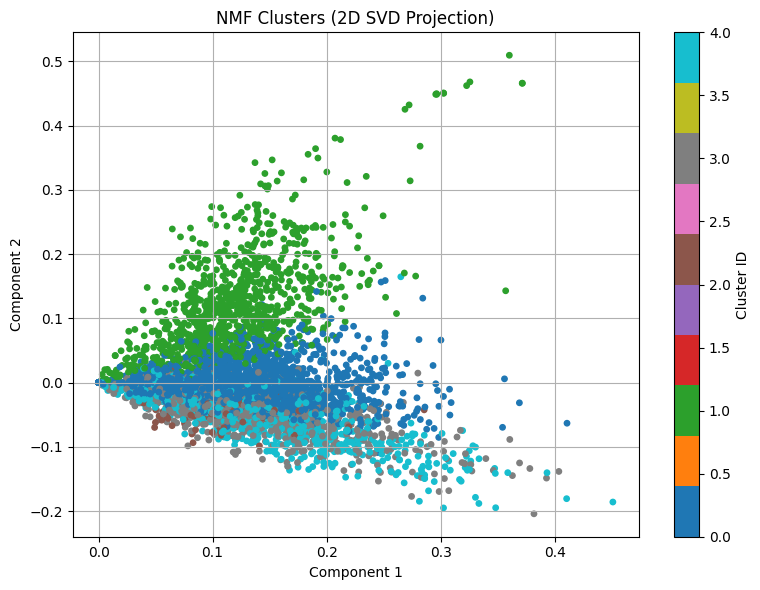
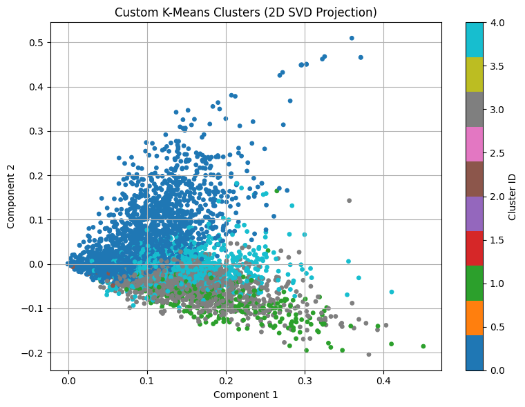
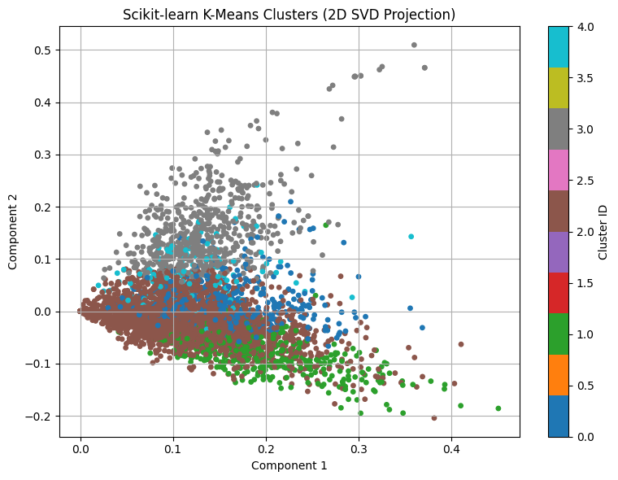

# NMF and K-Means Text Clustering

An unsupervised text-clustering study on five categories from the
[20 Newsgroups dataset](https://scikit-learn.org/stable/modules/generated/sklearn.datasets.fetch_20newsgroups.html).
The project compares topic assignments from Non-negative Matrix Factorization
(NMF), a from-scratch Lloyd-style K-Means implementation, and scikit-learn's
K-Means.

The full workflow is available in
[`text-clustering-analysis.ipynb`](text-clustering-analysis.ipynb), including
data loading, preprocessing, TF-IDF vectorization, clustering, evaluation, and
visualization.

## Dataset and preprocessing

The experiment uses **4,659 documents** from five 20 Newsgroups categories:

- `alt.atheism`
- `comp.graphics`
- `sci.med`
- `sci.space`
- `talk.politics.guns`

The notebook explicitly uses `subset="all"` because the goal is unsupervised
structure discovery rather than predictive evaluation on a held-out test set.

Headers, footers, and quoted text are removed by `fetch_20newsgroups`. The
remaining text is lowercased, stripped of numbers and stop words, tokenized,
POS-tagged, and lemmatized with NLTK.

`TfidfVectorizer` then produces a sparse matrix of shape:

```text
(4659, 15360)
```

using `min_df=2` and `max_df=0.95`.

## Methods

Three five-cluster models are evaluated:

1. **NMF** with NNDSVDa initialization and coordinate descent.
2. **Custom K-Means**, implemented from scratch with Lloyd iterations and a
   local NumPy random generator.
3. **Scikit-learn K-Means** using K-Means++ initialization.

The custom implementation uses `np.random.default_rng`, so `random_state=0`
works correctly and the function does not modify NumPy's global random state.
It also recomputes the final labels against the final centroids before
returning them.

## Results

### Single-run clustering results

| Model | ARI | AMI | Silhouette (Euclidean) | Silhouette (Cosine) |
|---|---:|---:|---:|---:|
| **NMF** | **0.3501** | **0.4093** | 0.0059 | **0.0109** |
| Custom K-Means | 0.1935 | 0.2922 | 0.0062 | 0.0043 |
| Scikit-learn K-Means | 0.1638 | 0.3732 | **0.0083** | 0.0036 |

NMF shows the strongest agreement with the known newsgroup labels in this
single run, with the highest ARI and AMI. Scikit-learn K-Means has the highest
Euclidean Silhouette score, while NMF has the highest cosine Silhouette score.

All Silhouette scores remain close to zero. This indicates substantial overlap
between clusters in the high-dimensional TF-IDF representation and is
consistent with the fact that topical text categories do not necessarily form
well-separated Euclidean clusters.

### Controlled Custom vs. scikit-learn comparison

A direct comparison between the two K-Means implementations is sensitive to
initialization. The notebook therefore includes a second experiment in which
both implementations receive the **same initial centroids** for each seed.

Across **10 seeds**, the results are:

| Metric | Mean ± Std |
|---|---:|
| Custom K-Means ARI | 0.0975 ± 0.0699 |
| Custom K-Means AMI | 0.2049 ± 0.1431 |
| Scikit-learn K-Means ARI | 0.1026 ± 0.0634 |
| Scikit-learn K-Means AMI | 0.2252 ± 0.1269 |
| Custom vs. scikit-learn agreement (ARI) | 0.7557 ± 0.3770 |
| Custom vs. scikit-learn agreement (AMI) | 0.7689 ± 0.3465 |

The two implementations have similar mean external scores under shared
initialization. Their cluster assignments also show substantial average
agreement, although the relatively large standard deviations indicate that
agreement varies considerably across seeds. For that reason, the notebook does
not treat one initialization as a definitive implementation-level comparison.

For the original single-run configurations, where initialization differs
(random-document initialization for the custom implementation versus
K-Means++ for scikit-learn), the agreement between their assignments is:

```text
ARI = 0.1456
AMI = 0.3534
```

These values should not be interpreted as a pure implementation comparison,
because the initialization strategies are different.

## Cluster visualizations

All three plots use the same two-dimensional `TruncatedSVD` projection so that
their geometry is directly comparable.

### NMF



### Custom K-Means



### Scikit-learn K-Means



The 2D projections are visualization aids only. The clustering algorithms and
reported metrics operate on the full TF-IDF representation, not on the
two-dimensional projection.

## NMF topic terms

Representative high-weight terms from the fitted NMF components include:

| Topic | High-weight terms |
|---|---|
| General / space-related | `would`, `space`, `get`, `one`, `like`, `go`, `think`, `time`, `use`, `know` |
| Computer graphics | `file`, `image`, `format`, `thanks`, `program`, `graphic`, `please`, `color`, `know`, `anyone` |
| Residual signature / corpus artifact | `bank`, `geb`, `shameful`, `njxp`, `chastity`, `intellect`, `skepticism`, `surrender`, `gordon`, `soon` |
| Religion / atheism | `god`, `say`, `believe`, `atheist`, `belief`, `religion`, `one`, `atheism`, `exist`, `think` |
| Guns / policy | `gun`, `people`, `right`, `fire`, `law`, `would`, `weapon`, `fbi`, `crime`, `government` |

One component is dominated by signature-like or corpus-specific tokens. The
20 Newsgroups header/footer/quote removal is heuristic and does not eliminate
every artifact, so this component is treated as a **preprocessing limitation**
rather than assigned a confident semantic topic.

## Evaluation metrics

The notebook reports four complementary metrics:

- **Adjusted Rand Index (ARI):** agreement between predicted clusters and the
  known category labels, adjusted for chance.
- **Adjusted Mutual Information (AMI):** information-theoretic agreement with
  the known labels, also adjusted for chance.
- **Silhouette — Euclidean:** internal cluster cohesion/separation using
  Euclidean distance.
- **Silhouette — Cosine:** the same Silhouette framework using cosine distance,
  which is useful to inspect for sparse TF-IDF document vectors.

ARI and AMI use the known labels. Silhouette does not; it evaluates the
geometry of the clustering under the selected distance metric.

## Run locally

Python 3.9 or newer is recommended.

```bash
python3 -m venv .venv
source .venv/bin/activate
python3 -m pip install -r requirements.txt
jupyter notebook text-clustering-analysis.ipynb
```

The first notebook cell downloads the required NLTK resources. The 20
Newsgroups dataset is fetched by scikit-learn, so the first execution requires
an internet connection.

## Repository structure

```text
.
├── assets/
│   ├── custom-kmeans-clusters.png
│   ├── nmf-clusters.png
│   └── sklearn-kmeans-clusters.png
├── text-clustering-analysis.ipynb
├── requirements.txt
└── README.md
```
